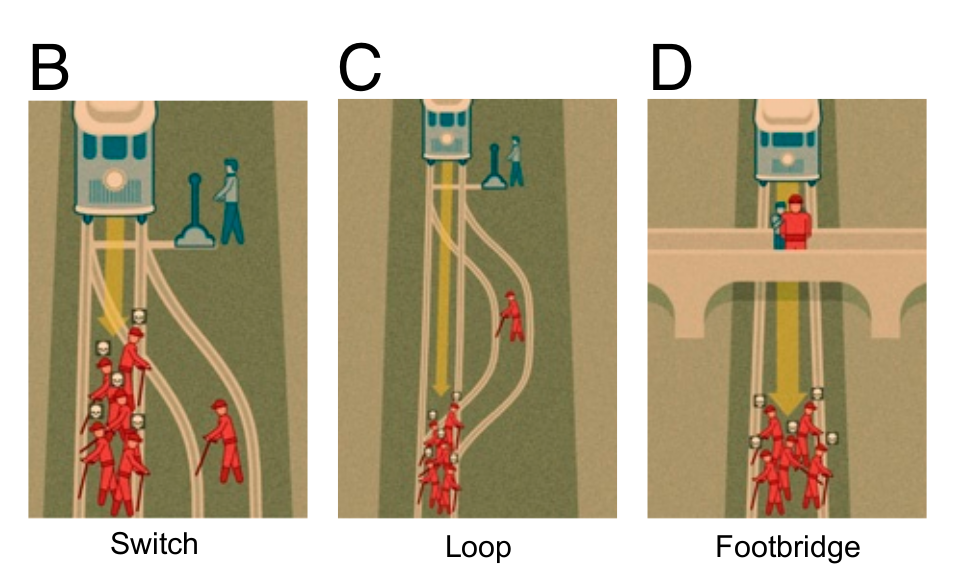

# Trolley problem analisys
An statistical analysis about the [Trolley problem](https://en.wikipedia.org/wiki/Trolley_problem) based and data gathered from [Moral Machine](https://www.moralmachine.net/)

  

 

Image from: [Universals and variations in moral decisions made in 42 countries by 70,000 participants](https://www.pnas.org/content/117/5/2332)

## Notes
* Our analysis: [Trolley problem](https://data-science-supsi-20-21-group-f.github.io/)
* Dataset used: _Shared_data_responses_demographics.csv_ from [Classic Trolley - Moral Machine website](https://bit.ly/2Y7Brr9)
* More info: [Universals and variations in moral decisions made in 42 countries by 70,000 participants](https://www.pnas.org/content/117/5/2332)

## Dependencies notebook
This notebook utilizes the following dependencies.
* Pandas
* Numpy
* Plotly
* Seaborn
* Country_converter
* Matplotlib
* Requests

License
----

MIT © S. Martins and A. Chinetti
